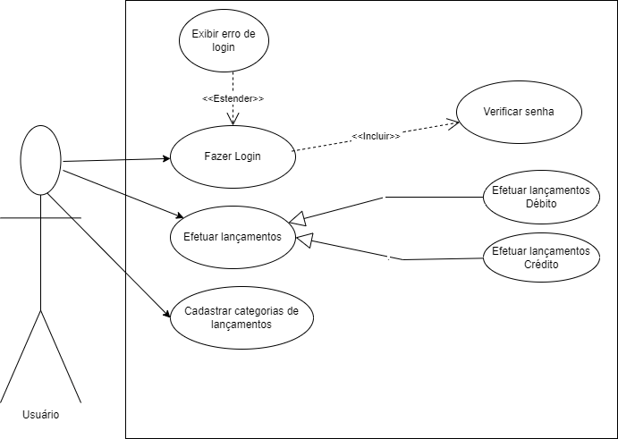

# Especificações do Projeto

Pré-requisitos: <a href="1-Documentação de Contexto.md"> Documentação de Contexto</a>

A definição do problema e os pontos mais relevantes a serem tratados neste projeto foram consolidadas com a participação dos usuários em um trabalho de imersão feita pelos membros da equipe a partir de conversas e entrevistas com potenciais usuários (amigos, familiares, colegas de trabalho). Os detalhes levantados nesse processo foram consolidados na forma de histórias de usuários.

## Personas

Demétrio Souza tem 19 anos, é estudante de Sistemas da informação e estagiário com a remuneração de R$ 1.620,00. Pensa em se programar para comprar um veículo em breve e percebeu que controlar seus gastos de cabeça não é eficaz. Atualmente está frustrado com o descontrole das suas despesas e com a má distribuição de sua renda.

Rosilene Fernandes tem 22 anos, é arquiteta recém-formada e trainee de Arquitetura com a remuneração de R$ 2.591,00. Rosilene quer controlar seus gastos com cartão de crédito e se programar para pagar sua pós graduação. Atualmente está frustrada pois precisou pagar o mínimo em sua fatura do cartão de crédito.

Samuel Vieira tem 17 anos, é jovem aprendiz e recebe R$ 653,00. Suas motivações são: juntar dinheiro, entender melhor sobre gerenciamento de gastos e ter uma melhor visão onde gasta seu dinheiro. Suas frustrações são: sua falta de controle financeiro, dificuldades em alcançar juntar dinheiro para comprar algo que tenha o valor muito maior do que sua remuneração mensal e sua impulsividade com compras.

Beatriz Sampaio tem 18 anos, é atendente de telemarketing home office e tem a remuneração de R$ 1.212,00. Suas motivações são: controlar seus gastos impulsivos com o cartão de crédito e juntar dinheiro. Suas frustrações são: falta de controle financeiro e dificuldade em controlar sua impulsividade de comprar com o cartão de crédito.

João Nascimento tem 23 anos, é técnico em enfermagem e tem a remuneração de R$ 1.874,00. Suas motivações são: não se enrolar com o cartão de crédito, controlar gastos, juntar dinheiro e evitar pagar contas em atraso. Suas frustrações são: não ver seu dinheiro render, vontade incontrolável de comprar, não conseguir pagar uma faculdade de Enfermagem e medo de ter os dados vazados em um sistema de controle financeiro.

## Histórias de Usuários

Com base na análise das personas forma identificadas as seguintes histórias de usuários:

|EU COMO... `PERSONA`| QUERO/PRECISO ... `FUNCIONALIDADE` |PARA ... `MOTIVO/VALOR`                 |
|--------------------|------------------------------------|----------------------------------------|
|Demétrio Souza   | Ter os gastos separados por seções. Ex: delivery, assinaturas           | Pra conseguir distribuir melhor a renda mensal              |
|Demétrio Souza        | Conseguir separar gastos entre débito e crédito                | Pra não ficar confuso entre os gastos do cartão de crédito e o que for no débito |
|Rosilene Fernandes         | Ter a visão do valor que tem guardado                 | Se programar para o futuro  |
|Rosilene Fernandes         | Conciliar compras no cartão                 | Saber se o que está na fatura do cartão bate com o que realmente foi gasto  |
|Samuel Vieira         | Desejo ter acesso a conteúdo sobre educação financeira                 | Fomentar meus conhecimentos a fim de ter um melhor controle dos meus gastos  |
|Samuel Vieira         | Ter a possibilidade de visualizar as minhas receitas e débitos do mês                 | Afim de controlar e mensurar meus gastos mês a mês  |
|Beatriz Sampaio         | Ver todos os meus gastos em uma mesma tela com um total                 | Saber o que posso e o que eu não posso gastar  |
|Beatriz Sampaio         | Criar metas de gastos                  | Ser informada periodicamente sobre a situação das metas |
|João Nascimento        | Ser lembrado que tenho despesas que irão vencer                 | Para não esquecer e efetuar o pagamento em dia |
|João Nascimento        | Saber se meus gastos aumentaram ou diminuíram em relação a períodos anteriores                 | Tentar verificar se estou economizando ou não |
|João Nascimento        | Ter meu próprio usuário para utilizar o sistema                 | Que outras pessoas não vejam meus lançamentos  |

## Requisitos

O escopo funcional do projeto é definido por meio dos requisitos funcionais que descrevem as possibilidades interação dos usuários, bem como os requisitos não funcionais que descrevem os aspectos que o sistema deverá apresentar de maneira geral. Estes requisitos são apresentados a seguir. 

### Requisitos Funcionais

|ID    | Descrição do Requisito  | Prioridade |
|------|-----------------------------------------|----|
|RF-001| O sistema permite agrupar valores por seções (categorias)  | ALTA | 
|RF-002| O sistema permite agrupar valores por subseções (subcategoria)   | ALTA |
|RF-003| O sistema permite o lançamento de débitos  | ALTA |
|RF-004| O sistema permite o lançamento de crédito | ALTA |
|RF-005| O sistema permite a conciliação dos gastos do cartão de crédito  | MÉDIA |
|RF-006| O sistema permite filtrar os lançamentos conciliados e os não conciliados  | MÉDIA |
|RF-007| O sistema permite datar/programar lançamentos (exemplo: pagamentos ou recebimentos futuros)  | ALTA |
|RF-008| O sistema terá uma área com conteúdo (curadoria?) voltados para educação financeira | ALTA |
|RF-009| O sistema permite a visualização de entradas, saídas, ativos e passivos por mês, trimestre e ano em uma única tela  | ALTA |
|RF-010| O sistema permite a definição e simulação (com manipulação) do atingimento da meta estabelecida  | ALTA |
|RF-011| O sistema informa as contas a vencer  | ALTA |
|RF-012| O sistema emitirá relatórios comparativos entre períodos determinados pelo usuário (relatório de evolução do atingimento da meta)  | MÉDIA |
|RF-013| O sistema terá tela de Login e senha | ALTA |

### Requisitos não Funcionais

|ID     | Descrição do Requisito  |Prioridade |
|-------|-------------------------|----|
|RNF-001| O site deve ser publicado em um ambiente acessível publicamente na Internet (Repl.it, GitHub Pages, Heroku) | ALTA | 
|RNF-002| O site deve ter bom nível de contraste entre os elementos da tela em conformidade |  ALTA | 
|RNF-003| O site deve ser compatível com os principais navegadores do mercado (Google Chrome, Firefox, Microsoft Edge)  |  ALTA | 
|RNF-004| O site será modelado usando UML 2.3  |  ALTA |
|RNF-005| O site deve ter interface gráfica amigável  |  ALTA |

## Restrições

O projeto está restrito pelos itens apresentados na tabela a seguir.

|ID| Restrição                                             |
|--|-------------------------------------------------------|
|01| O projeto deverá ser entregue no final do semestre letivo, não podendo extrapolar a data de 11/12/2022 |
|02| O aplicativo deve se restringir às tecnologias básicas da Web no Frontend, Back End e banco de dados        |
|03| A equipe não pode subcontratar o desenvolvimento do trabalho        |
|04| A equipe usará o Kanban para o gerenciamento do projeto        |

## Diagrama de Casos de Uso

O diagrama contempla as principais ligações previstas entre casos de uso e atores e permite detalhar os Requisitos Funcionais identificados na etapa de elicidação. Lembrando que  não se utiliza diagramas de caso de uso para requisitos não-funcionais. 

Como atores é importante a identificação dos grupos de todos os envolvidos que interagem com o sistema, principalmente outros sistemas ou sensores. Eles são representados graficamente por bonecos-palito e serão nomeados pelos papéis nas interações nas quais estão envolvidos (ex. Cliente, Administrador). Lembre-se de que o próprio sistema não pode ser ator do diagrama que o modela. 

Em relação aos casos de uso, eles devem representar as interações ou transações dos atores com o sistema. Cada tipo possível é representada por uma elipse nomeada e os relacionamentos são indicados por linhas que podem ter setas nos casos em que se indica a origem da interação. Os nomes dos casos de uso representam verbos no infinitivo associados aos objetos com os quais se relacionam os verbos (ex. Cadastrar usuário, Visualizar relatório). Os tipos de relacionamentos mais comuns são associações entre atores e casos de uso, generalizações entre atores e entre casos de uso, inclusões e extensões entre casos de uso.

