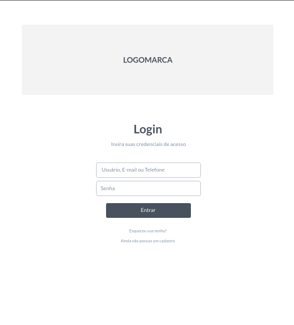
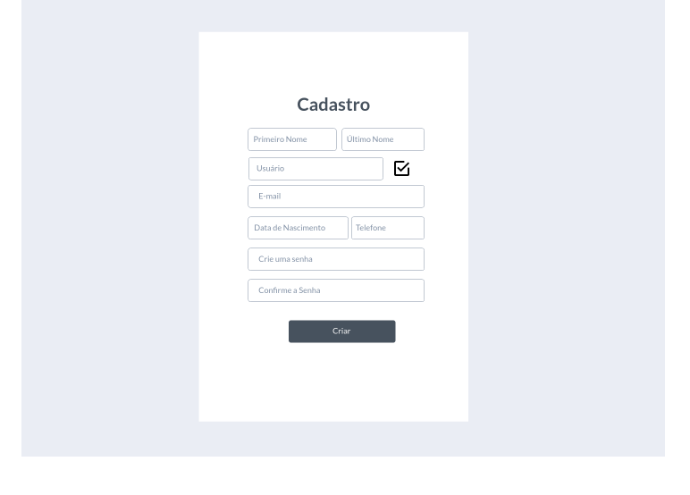

# Projeto de Interface

Estamos estabelecendo foco em questões como acessibilidade, agilidade e usabilidade. O projeto tem identidade visual padronizada em todas as telas e são projetadas para funcionamento nos principais navegadores desktop do mercado (Google Chrome, Firefox, Microsoft Edge).

Importante destacar que  o projeto foi elaborado de forma a atender os requisitos funcionais, não funcionais e histórias de usuários abordados na <a href="https://github.com/ICEI-PUC-Minas-PMV-ADS/pmv-ads-2022-2-e2-proj-int-t4-controle-financeiro/blob/9cfc29228317e3ac74c535ec5ab7e9d08bdfcb05/docs/02-Especifica%C3%A7%C3%A3o%20do%20Projeto.md"> Documentação de Especificação </a>.

## Diagrama de Fluxo

## Wireframes

O Wireframe interativo da solução foi projetada no Marvel APP, e pode ser acessado por <a href="https://marvelapp.com/prototype/81dga60"> Este link. </a>.
O site da aplicação será composto por uma área de login, cadastro, recuperação de senha e da Plataforma interativa. 

**Página de Login** 

Na página de login é possível prosseguir para a plataforma (se já houver o cadastro), prosseguir para a página de cadastro ou recuperação de senha.

**Página de Cadastro**

Na página de cadastro serão solicitados os dados necessários conforme a imagem abaixo para que possa criar uma autenticação para acesso à plataforma interativa.

**Página de Recuperação de senha**

Já a página de recuperação de senha é utilizada quando o usuário da plataforma, por algum motivo, perder a sua senha de acesso.

**A plataforma interativa**

Uma vez cadastrado, o usuário terá acesso a página da aplicação. 

O conceito desta página foi elaborado buscando um visual simples, objetivo e eficaz, onde apresentará todas as informações necessárias para utilização do sistema por qualquer tipo de usuário.

Na barra superior contém a logomarca "ZCaixa", botões de atualizar e incluir lançamentos, a barra de progresso da meta cadastrada e local de opções do usuário.

Na barra lateral esquerda, terá campos que exibem os saldos e categorias de acordo com os lançamentos do usuário, e um botão para o cadastro de metas.

No campo central se encontra a GRID de lançamentos com seus respectivos títulos.

.png)
