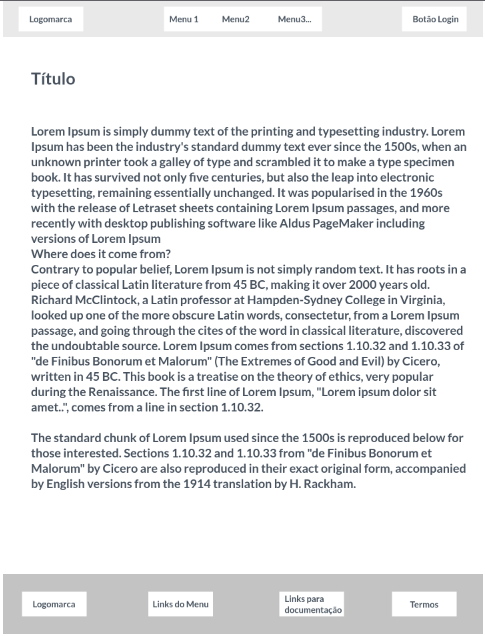
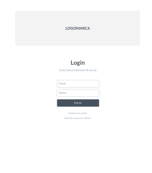

# Projeto de Interface

Estamos estabelecendo foco em questões como acessibilidade, agilidade e usabilidade. O projeto tem identidade visual padronizada em todas as telas e são projetadas para funcionamento nos principais navegadores desktop do mercado (Google Chrome, Firefox, Microsoft Edge).

Importante destacar que  o projeto foi elaborado de forma a atender os requisitos funcionais, não funcionais e histórias de usuários abordados na <a href="https://github.com/ICEI-PUC-Minas-PMV-ADS/pmv-ads-2022-2-e2-proj-int-t4-controle-financeiro/blob/9cfc29228317e3ac74c535ec5ab7e9d08bdfcb05/docs/02-Especifica%C3%A7%C3%A3o%20do%20Projeto.md"> Documentação de Especificação </a>.

## Diagrama de Fluxo

## Wireframes

O Wireframe interativo da solução foi projetada no Marvel APP, e pode ser acessado por <a href="https://marvelapp.com/prototype/81dga60"> Este link. </a>.
O site da aplicação será composto por uma área "institucional" onde haverá uma página de apresentação (homepage), uma página apresentando os detalhes da aplicação (Sobre), Uma página com conteúdos para desenvovlimento da educação financeira do usuário e também a página de termos, login, cadastro, recuperação de senha e da Plataforma interativa. 

**Cabeçalho e Rodapé**

A aplicação irá conter o cabeçalho e rodapé padronizados nas páginas "institucionais", ou seja, toda a área da aplicação que não requer login e senha para acesso.
O cabeçalho abriga a logomarca da aplicação "ZCaixa" juntamente com o menu de navegação e botão da área de Login. 
O Rodapé conterá a logomarca, links do menu, links para a documentação do projeto no GITHUB e link para os termos de cookies.

**Homepage / Tela inicial**

A tela inicial da aplicação ou homepage, apresenta uma área para imagem destaque, seguido de áreas para conteúdos de apresentação da plataforma e educação financeira.
Todo seu conteúdo será para fins convidativos à utilização da aplicação pelo usuário.

**Página Sobre** 

A página sobre apresenta sessões de texto e imagens contendo informações do projeto, tais como O problema identificado, a justificativa e visão da solução. 

**Página Educação Financeira**

Esta página contém conteúdos em vídeos, texto e imagens para influenciar o desenvolvimento de práticas, hábitos e noções sobre educação financeira.

**Página de Termos** 

A página de termos terá o conteúdo sobre quais dados serão coletados e como serão geridos pela aplicação.

**Página de Login** 

A página de login já não contempla o cabeçalho e rodapé das demais páginas, pois assim como a página da plataforma interativa não são partes ligadas as páginas instituicionais. O objetivo é que não haja alternação de páginas enquanto é feito a sua utilização. Na página de login é possível prosseguir para a plataforma (se já houver o cadastro), prosseguir para a página de cadastro ou recuperação de senha.

**Página de Cadastro**

Na página de cadastro serão solicitados os dados necessários conforme a imagem abaixo para que possa criar uma autenticação para acesso à plataforma interativa.

**Página de Recuperação de senha**

Já a página de recuperação de senha é utilizada quando o usuário da plataforma, por algum motivo, perder a sua senha de acesso.

**A plataforma interativa**

Uma vez cadsatrado, o usuário terá acesso a página da aplicação. 
O conceito desta página foi elaborado buscando um visual simples, objetivo e eficaz. Onde apresentará todas as informações necessárias para utilização do sistema por qualquer tipo de usuário.
Na barra superior contém a logomarca "Zcaixa", botões de atualizar e incluir lançamentos, a barra de progresso da meta cadastrada e local de opções do usuário.
Na barra lateral esquerda, terá campós que exibem os saldos dos grupos e categorias de acordo com os lançamentos do usuário, e botoes a área de simulação e gerencia de metas.
No campo Central se encontra a GRID de lançamentos com seus respectivos títulos dos detalhes dos lançamentos, e na parte inferior contém o botão para a geração de relatórios ou gráficos dos lançamentos.

