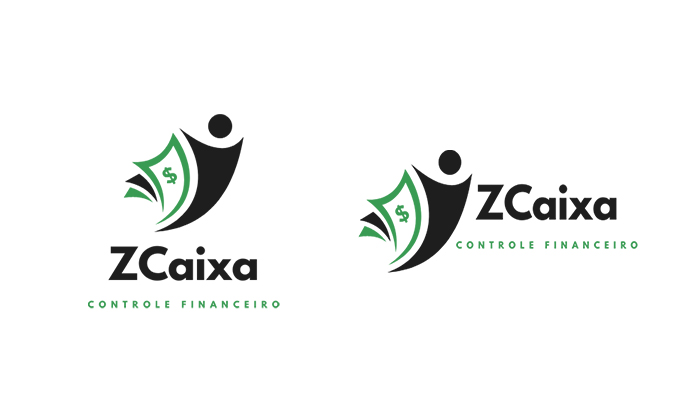
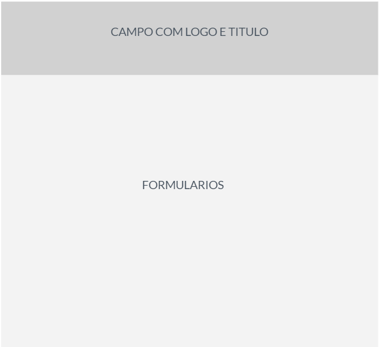

# Template Padrão da Aplicação

Pré-requisitos: <a href="2-Especificação do Projeto.md"> Especificação do Projeto</a>, <a href="3-Projeto de Interface.md"> Projeto de Interface</a>, <a href="4-Metodologia.md"> Metodologia</a>

As páginas serão desenvolvidas objetivamente para uso em Desktops, e contará com responsividade baseando nas dimensões de tela do iphone X e iPad (contidos na inspeção do Google Chrome) o que poderá ocasionar na ocultação de algumas funcionalidades.

### Logomarca, Cores padrões e iconografia

Através do Canva - ferramenta de criação de artes gráficas grátis - definimos o nome e a logomarca da aplicação, denominada Zcaixa. A logomarca possui duas variações, sendo sua versão de forma vertical e horizontal que serão usadas em diferentes telas pelas páginas institucionais e aplicação.

As definições de cores para serem utilizadas pelas páginas do projeto, se basearam nas cores definidas na própria logomarca e diferentes tons de cinza para obter contraste e harmonia das tonalidades dos objetos de design. 

Cor primária: #1e1e1e
Cor secundária: #399b53
Cor terciária: #fafafa

Já a fonte family, selecionamos a "Noto Sans KR" com as espressuras 100, 300, 400, 500 e 700 disponibilizada pelo Google Fonts gratuitamente. 

Selecionamos a iconografia grátis disponibilizada pelo site http://www.gonzodesign.nl/gonzocons/ onde contém os ícones que seguirá o padrão visual da aplicação como um todo, e atende de forma clara e objetiva a comunicação com o usuário de acordo com sua finalidade.

### Páginas institucionais (Página Inicial, Sobre e Educação Financeira)

O template padrão da aplicação interativa e páginas institucionais (onde se navega sem a necessidade de login) terão arquiteturas diferentes de desgin, uma vez que as páginas institucionais possuem cabeçalho e rodapé padrões entre si, se diferenciando da aplicação. 

As páginas institucionais seguirão o esquema padrão abaixo quanto ao conteúdo apresentado, com cabeçalho, conteúdo e rodapé.

### Páginas relacionadas ao login e cadastro (Página de Login, Cadastro e Recuperação de senha)

As páginas de login cadastro e recuperação de senha não possuirão cabeçalho e rodapé, sendo exclusivas para os formulários nelas presentes.

### Página da aplicação interativa

Seguirá conforme o wireframe apresentado na seção "Projeto de interface" onde seguirá o esquema de cores padronizados conforme varíaveis mencionadas na seção acima.

