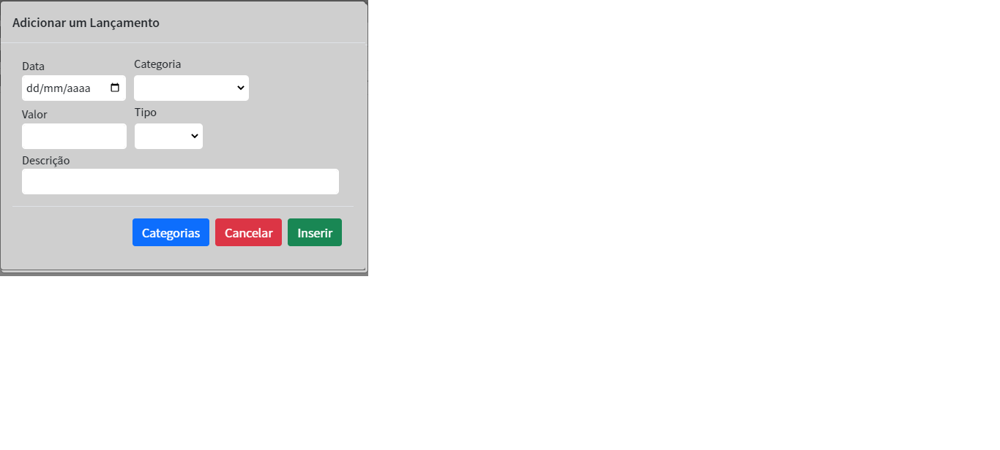
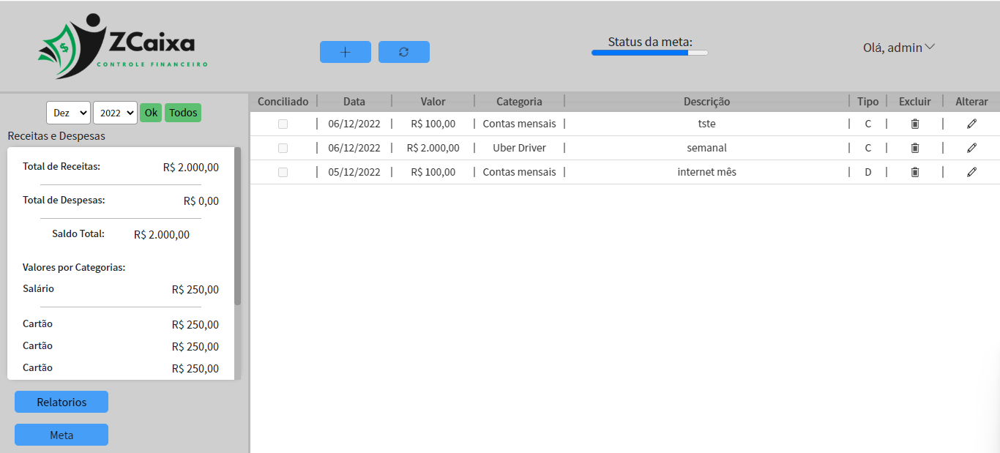
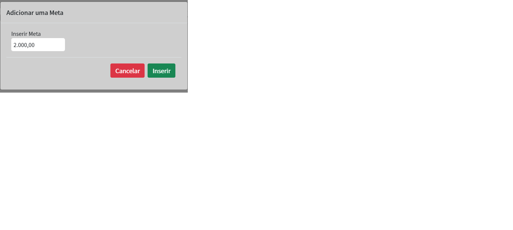

# Registro de Testes de Software

***Caso de Teste - 01 - Acessar tela de login e cadastro de usuário***

***Caso de Teste - 02 - Criar categorias***

***Caso de Teste - 03 - Fazer lançamentos, visualizar lançamentos por mês (entradas e saída por mês)***

***Caso de Teste - 04 -  Definir meta e visualizar alterações no status da meta***

## Avaliação

Os resultados dos Casos de Testes acima atenderam os requisitos dentro das funcionalidades propostas na aplicação. É possível identificar a correspondência do sistema com o mundo real através dos ícones dos botões. Em futuras versões espera-se que sejam aplicadas melhorias nas funcionalidades já existentes, por exemplo, o status da meta descrever a porcetagem do progresso. 

