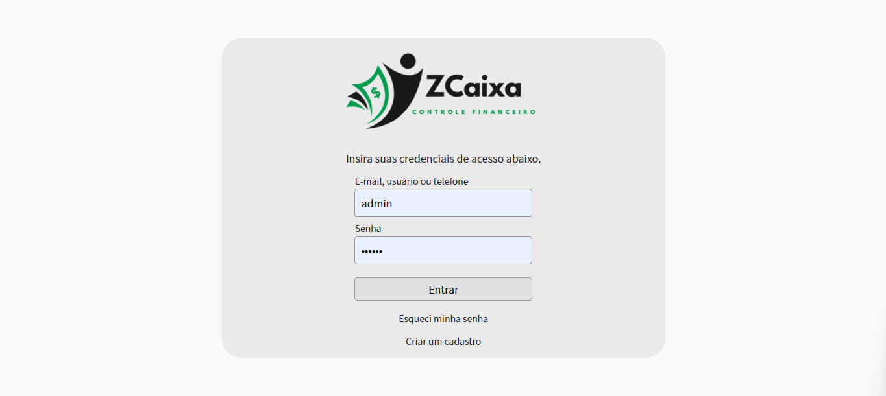
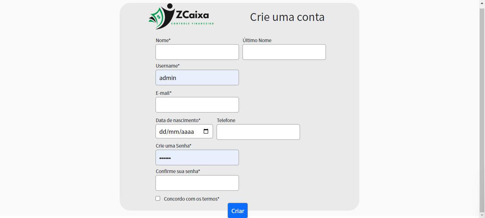
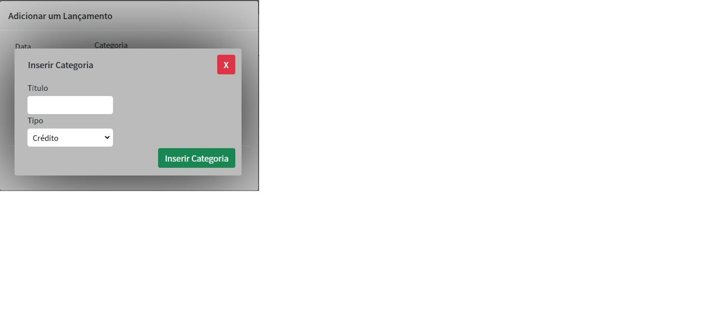
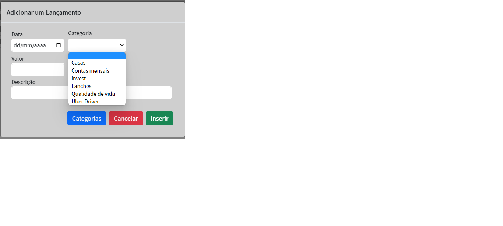

# Registro de Testes de Software

***Caso de Teste - 01 - Acessar tela de login e cadastro de usuário***

***Caso de Teste - 02 - Criar categorias***

***Caso de Teste - 03 - Fazer lançamentos, visualizar lançamentos por mês (entradas e saída por mês)***

## Avaliação

Discorra sobre os resultados do teste. Ressaltando pontos fortes e fracos identificados na solução. Comente como o grupo pretende atacar esses pontos nas próximas iterações. Apresente as falhas detectadas e as melhorias geradas a partir dos resultados obtidos nos testes.

> **Links Úteis**:
> - [Ferramentas de Test para Java Script](https://geekflare.com/javascript-unit-testing/)
